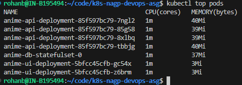
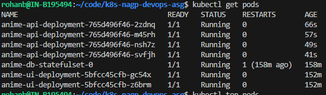
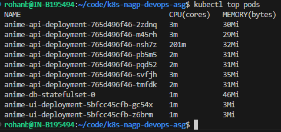
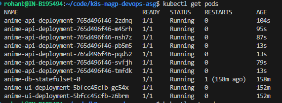
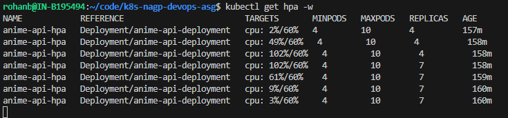

# Assignment Deliverables

## Deliverables

* Source Code for the project. Provide repository URL, don't upload whole source code.
  * **Repository URL**: [github.com/code-licker/k8s-devops-asg](https://github.com/code-licker/k8s-devops-asg)
  * Make sure it includes all Kubernetes YAML files used in the assignment.
    * All manifests are in the [k8s/](../k8s) directory.
  * Dockerfile should be present as well.
    * API Dockerfile: [apps/anime-api/Dockerfile](../apps/anime-api/Dockerfile)
    * UI Dockerfile: [apps/anime-ui/Dockerfile](../apps/anime-ui/Dockerfile)
    * DB Dockerfile: [apps/anime-db/Dockerfile](../apps/anime-db/Dockerfile)
  * Repository can be GitHub or Gitlab. **DO NOT use your project source code.**
    * Used GitHub repository: [k8s-devops-asg](https://github.com/code-licker/k8s-devops-asg)
* Also include a README file in code which has:
  * Link for the code repository.
    * [GitHub Repository Link](https://github.com/code-licker/k8s-devops-asg)
  * Docker hub URL for docker images.
    * **GHCR Registry Paths**:
      * UI: `ghcr.io/code-licker/nagp-2026-anime-ui:2.0.0`
      * API: `ghcr.io/code-licker/nagp-2026-anime-api:1.0.0`
      * DB: `ghcr.io/code-licker/nagp-2026-anime-db:1.0.0`
  * URL for Service API tier to view the records from backend tier.
    * **External Ingress API Endpoint**: [http://135.235.144.73/api/anime](http://135.235.144.73/api/anime)
    * **External Ingress UI Endpoint**: [http://135.235.144.73/](http://135.235.144.73/)
        > **Note**:  
            - I have hosted the app on AKS as I get some monthly credits for free.  
            - If the above endpoints are not working, it's because I might have stopped the cluster to save costs.
  * Screen recording video showing all the objects deployed in Kubernetes cluster:
    * [Recording Video Link](https://www.youtube.com/watch?v=dQw4w9WgXcQ)
    * The recording demonstrates:
      * All objects deployed and running (`kubectl get all`).
      * API call retrieving records from the database.
      * Killing the API microservice pod and showing it auto-recovers (self-healing).
      * Killing the database pod and showing it auto-recovers without losing data (persistence).
      * Deployments, self-healing, storage persistence, rolling update strategy, and FinOps constraints.
* Prepare a comprehensive documentation that includes the following sections:
  * **Requirement Understanding**: Containerize and deploy a scalable, self-healing 3-tier app (UI, API, database) on Kubernetes (AKS/GKE) using ConfigMaps/Secrets for config separation, Ingress for routing, and HPA for autoscaling.
  * **Assumptions**: 
    * Cluster has access to GitHub Container Registry.
    * Database user and password are encrypted via Opaque Secrets.
  * **Solution Overview**: 
    * UI (React) and API (Node.js) deployments are managed under ClusterIP services exposed via an Nginx Ingress Class.
    * DB (PostgreSQL) is managed under a `StatefulSet` with a `PersistentVolumeClaim` (5Gi storage) to ensure database files are preserved.
    * HPA automatically scales the API deployment between 4 and 10 pods when CPU usage passes 60%.
  * **Justification for the Resources Utilized**: 
    * **API**: Request `50m` CPU / `64Mi` RAM. Limit `200m` CPU / `128Mi` RAM. (Ensures minimal idle resource utilization while supporting HPA trigger metrics).
    * **UI**: Request `50m` CPU / `64Mi` RAM. Limit `100m` CPU / `128Mi` RAM. (Nginx serving static files runs on minimal overhead and nginx is FOSS).
    * **DB PVC**: 5Gi Storage. (Sufficient volume space to hold database catalog files and PostgresSQL is FOSS).

* FinOps Requirements
  * Define CPU and memory requests and limits for the service/API tier.
    * API: `CPU: 50m`, `Memory: 64Mi` (Request), `CPU: 200m`, `Memory: 128Mi` (Limit)
    * UI: `CPU: 50m`, `Memory: 64Mi` (Request), `CPU: 100m`, `Memory: 128Mi` (Limit)
  * Identify at least three opportunities to optimize Kubernetes costs.
    * **Used PostgresDB**: It's FOSS (Free and Open Source Software) and runs inside the cluster as a pod, so there are no recurring database hosting or software license fees.
    * **Right-Sized Resource Allocations**: Reduced requests (`50m` CPU, `64Mi` RAM) close to what the app actually uses when running, preventing overallocation and wasted compute capacity.
    * **Registry Optimization**: Using GHCR instead of Docker Hub to store and retrieve images, reducing egress costs and latency.
  * Implement resource optimization using observed metrics.
    * I monitored pod CPU usage during idle state and active load to verify and adjust limits.
    * **Idle Resource Usage (1m CPU)**:  
        
        
    * **Resource Usage Under Peak Load (spikes to ~201m CPU)**:  
          
        
    * **Autoscaling Target Triggered (Replicas scaled from 4 to 7)**:  
      

* Thankyou for reading all this stuff till here. [🎁 Here is a small gift from my side. 🎁 How to get $200 Azure credits for free 🎁](https://www.youtube.com/watch?v=dQw4w9WgXcQ)